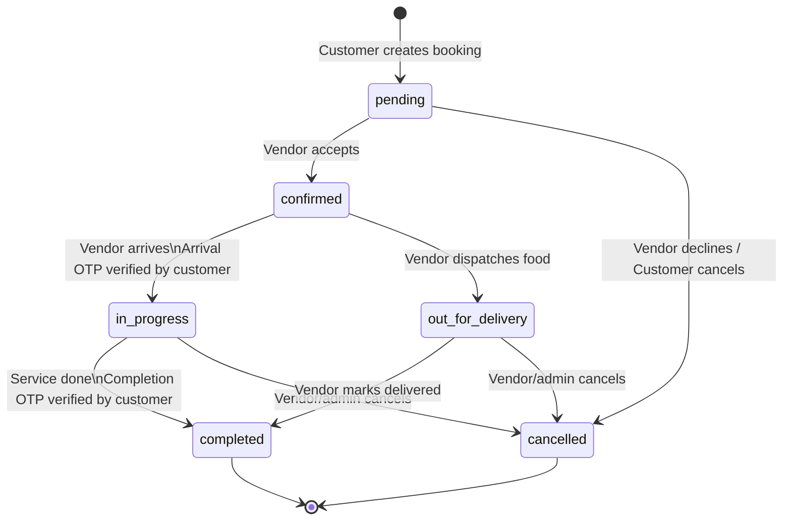

# Veranda — Bookings High-Level Design (HLD)

---

## 1. Overview

The Booking system is the core revenue engine of Veranda. It handles two distinct service tracks with different workflows:

| Track      | Category Types     | OTP Required | Delivery |
|-----------|-------------------|--------------|---------|
| Services  | plumber, maid, electrician, AC repair, etc. | 2x OTP (arrival + completion) | Vendor goes to customer |
| Tiffin    | tiffin, home cook  | None         | Vendor delivers to customer |

---

## 2. Full Booking State Machine



---

## 3. Services Booking Flow (Dual OTP)

```
CUSTOMER                       SYSTEM                         VENDOR
──────────                     ──────                         ──────
Book listing ──────────────► POST /bookings
                              status = pending
                                                ◄─────────── Accept booking
                              status = confirmed
                                                ◄─────────── Click "I've Arrived"
                              POST /send-arrival-otp
                              Generate 6-digit OTP
                              Save to bookings.completion_otp
SMS: "OTP: 482917" ◄────────  [Production: send SMS]
                              [Dev: return in response]
Read OTP to vendor ──────────────────────────────────────► Enter OTP
                              POST /verify-otp
                              status = in_progress ──────────► See "🔧 In Progress"
                                                               (service being done...)
                                                ◄─────────── Click "Mark Done"
                              POST /send-completion-otp
                              Generate NEW 6-digit OTP
                              Save to bookings.completion_otp
SMS: "OTP: 731042" ◄────────  [Production: send SMS]
                              [Dev: return in response]
Read OTP to vendor ──────────────────────────────────────► Enter OTP
                              POST /verify-otp
                              status = completed ◄──────────► ✅ Booking Complete
```

---

## 4. Tiffin Booking Flow (No OTP)

```
CUSTOMER                       SYSTEM                         VENDOR
──────────                     ──────                         ──────
Book listing ──────────────► POST /bookings
Address required ✓            status = pending
                                                ◄─────────── Accept booking
                              status = confirmed
                                                ◄─────────── Click "🛵 Out for Delivery"
                              PUT /status (out_for_delivery)
"🛵 Food on the way!" ◄──────  Realtime notification
                                                ◄─────────── Click "✅ Mark Delivered"
                              PUT /status (completed)
"✅ Order delivered!" ◄───────  Realtime notification
```

---

## 5. API Endpoints

| Method | Endpoint | Auth | Description |
|--------|----------|------|-------------|
| `POST` | `/api/bookings` | Customer | Create a booking |
| `GET` | `/api/bookings/mine` | Customer | Get customer's bookings |
| `GET` | `/api/bookings/vendor` | Vendor | Get vendor's incoming bookings |
| `PUT` | `/api/bookings/:id/status` | Vendor | Update status (confirmed, out_for_delivery, completed, cancelled) |
| `POST` | `/api/bookings/:id/send-arrival-otp` | Vendor | Generate & send arrival OTP (confirmed → triggers) |
| `POST` | `/api/bookings/:id/send-completion-otp` | Vendor | Generate & send completion OTP (in_progress → triggers) |
| `POST` | `/api/bookings/:id/verify-otp` | Vendor | Verify OTP: confirmed→in_progress OR in_progress→completed |
| `DELETE` | `/api/bookings/:id` | Customer | Cancel a pending booking |

---

## 6. OTP Design

| Property | Value |
|---------|-------|
| Length | 6 digits |
| Generation | `crypto.randomInt(100000, 1000000)` — cryptographically secure |
| Expiry | 15 minutes |
| Storage | `bookings.completion_otp` (VARCHAR 6) + `bookings.otp_expires_at` |
| Reuse | Same column used for both arrival and completion OTPs (sequential, never overlap) |
| After use | Both fields set to `NULL` on successful verification |
| Dev mode | OTP returned in API response + logged to server console |
| Production | SMS via MSG91 (India) — TODO: wire up API key |

---

## 7. Status Transition Rules (Server-Enforced)

```
PUT /status allowed values: confirmed, out_for_delivery, completed, cancelled

Services (non-tiffin):
  ✅ confirmed → in_progress       via verify-otp only
  ✅ in_progress → completed       via verify-otp only
  ❌ out_for_delivery               blocked (tiffin only)
  ❌ completed without in_progress  blocked

Tiffin:
  ✅ confirmed → out_for_delivery
  ✅ out_for_delivery → completed
  ❌ in_progress                    not applicable
  ❌ completed without out_for_delivery  blocked
```

---

## 8. Real-time Notifications (Supabase Realtime)

Customer receives in-app toast when their booking status changes:

| Status Change | Toast Message |
|-------------|--------------|
| → `confirmed` | 🎉 Your booking has been confirmed! |
| → `in_progress` | 🔧 Service provider has arrived and started work! |
| → `out_for_delivery` | 🛵 Your food is on the way! |
| → `completed` | ✅ Booking completed. Thanks for using Veranda! |
| → `cancelled` | ❌ Your booking was cancelled by the vendor. |

Implementation: `useBookingRealtime(profileId)` hook — subscribes to `postgres_changes` on the `bookings` table filtered by `customer_id`.

---

## 9. Customer Dashboard — Status UI

| Status | Tab | Badge Color | Banner |
|--------|-----|------------|--------|
| `pending` | Upcoming | Amber | — |
| `confirmed` | Confirmed | Green | — |
| `in_progress` | 🔧 In Progress | Amber | "Service is in progress at your location" |
| `out_for_delivery` | On the Way 🛵 | Pink | "Your food is on the way!" |
| `completed` | Completed | Blue | — |
| `cancelled` | Cancelled | Red | — |

---

## 10. Vendor Dashboard — Booking Card Actions

### Services Booking
```
Status: pending     → [Accept] [Decline]
Status: confirmed   → [📍 I've Arrived]
                       ↓ (OTP sent to customer)
                      [🔧 Dev OTP: 482917]
                      [Enter OTP] [Start ✓]
Status: in_progress → [✅ Mark Done]
                       ↓ (OTP sent to customer)
                      [🔧 Completion OTP: 731042]
                      [Enter OTP] [Done ✓]
Status: completed   → (no actions)
```

### Tiffin Booking
```
Status: pending          → [Accept] [Decline]
Status: confirmed        → [🛵 Out for Delivery]
Status: out_for_delivery → [✅ Mark Delivered]
Status: completed        → (no actions)
```

---

## 11. Database Migrations Applied

| Migration File | Description |
|---------------|-------------|
| `20260528000000_booking_awaiting_confirmation.sql` | Added `awaiting_confirmation` to enum (deprecated) |
| `20260528000001_booking_out_for_delivery.sql` | Added `out_for_delivery` to enum |
| `20260528000002_booking_completion_otp.sql` | Added `completion_otp` + `otp_expires_at` columns |
| `20260528000003_booking_in_progress.sql` | Added `in_progress` to enum |

---

## 12. Security Considerations

- OTPs generated using `crypto.randomInt()` — NOT `Math.random()` (cryptographically secure)
- OTPs expire in 15 minutes
- OTPs stored as plaintext (short-lived, single-use — acceptable for this use case)
- OTPs cleared from DB immediately after successful verification
- Vendor can only verify OTPs for their own bookings (FK check)
- `dev_otp` is only returned when `NODE_ENV !== 'production'`
- All 500 errors use generic messages — raw DB errors never exposed to client

---

## 13. Pending / Future Work

| Feature | Priority | Step |
|---------|----------|------|
| Razorpay payment after completed | 🔴 High | Step 13 |
| MSG91 SMS integration (real OTP) | 🔴 High | Step 15 |
| Reviews & ratings after completed | 🟡 Medium | Step 14 |
| Booking cancellation with refund | 🟡 Medium | Step 13+ |
| Admin dispute resolution | 🟢 Low | Later |
| Repeat/subscription bookings (tiffin monthly) | 🟢 Low | Later |
