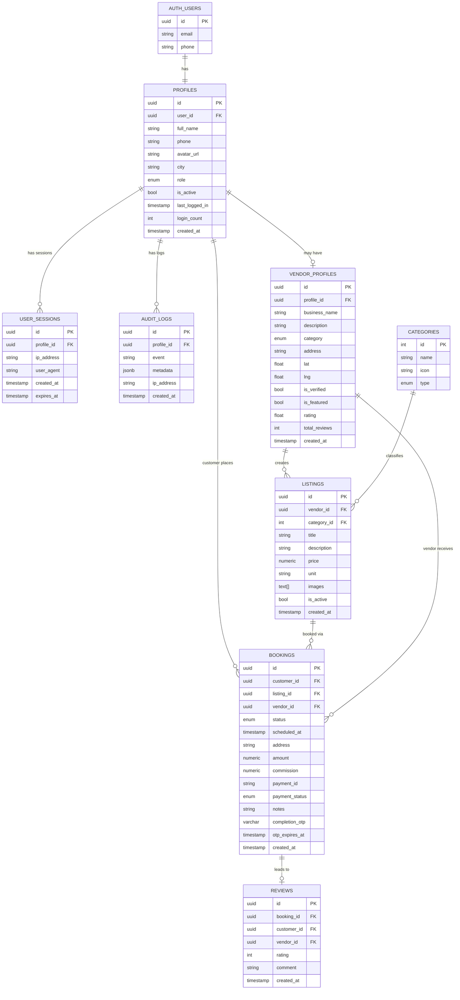

# Veranda — Database Schema Reference

## Entity Relationship Diagram



---

## Table Details

### `profiles`
> Extends Supabase `auth.users`. Created automatically on sign up.

| Column          | Type        | Constraints         | Notes                           |
|----------------|-------------|---------------------|---------------------------------|
| id              | uuid        | PK, default uuid    |                                 |
| user_id         | uuid        | FK → auth.users(id) | 1-to-1 with auth                |
| full_name       | text        | NOT NULL            |                                 |
| phone           | text        |                     |                                 |
| avatar_url      | text        |                     | Stored in Supabase Storage      |
| city            | text        |                     | e.g. Vijayawada, Gudivada       |
| role            | enum        | NOT NULL            | `customer` / `vendor` / `admin` |
| is_active       | boolean     | default true        | Admin can deactivate account    |
| last_logged_in  | timestamptz |                     | Updated on every login          |
| login_count     | int         | default 0           | Total login count               |
| created_at      | timestamptz | default now()       |                                 |

---

### `vendor_profiles`
> Only exists for users with role = `vendor`.

| Column         | Type        | Constraints           | Notes                         |
|---------------|-------------|----------------------|-------------------------------|
| id             | uuid        | PK, default uuid      |                               |
| profile_id     | uuid        | FK → profiles(id)     | 1-to-1 with profile           |
| business_name  | text        | NOT NULL              |                               |
| description    | text        |                       |                               |
| category       | enum        | NOT NULL              | `services` / `tiffin`         |
| address        | text        |                       |                               |
| lat            | float8      |                       | For distance-based search     |
| lng            | float8      |                       |                               |
| is_verified    | boolean     | default false         | Admin verifies FSSAI/ID       |
| is_featured    | boolean     | default false         | Paid promotion                |
| rating         | float4      | default 0             | Avg of all reviews            |
| total_reviews  | int         | default 0             |                               |
| created_at     | timestamptz | default now()         |                               |

---

### `categories`
> Seed data — pre-filled, not user-created.

| Column | Type   | Notes                                              |
|--------|--------|----------------------------------------------------|
| id     | serial | PK                                                 |
| name   | text   | e.g. Plumber, Electrician, Tiffin, House Cleaning  |
| icon   | text   | emoji or icon name                                 |
| type   | enum   | `services` / `tiffin`                              |

**Seed values:**
| id | name            | icon | type     |
|----|----------------|------|----------|
| 1  | Tiffin Service  | 🍱   | tiffin   |
| 2  | Home Cook       | 👨‍🍳   | tiffin   |
| 3  | Plumber         | 🔧   | services |
| 4  | Electrician     | ⚡   | services |
| 5  | House Cleaning  | 🧹   | services |
| 6  | Carpenter       | 🪚   | services |
| 7  | Painter         | 🎨   | services |
| 8  | AC Repair       | ❄️   | services |

---

### `listings`
> A vendor can have multiple listings (e.g. different tiffin plans or service types).

| Column      | Type        | Constraints            | Notes                          |
|------------|-------------|------------------------|--------------------------------|
| id          | uuid        | PK, default uuid        |                                |
| vendor_id   | uuid        | FK → vendor_profiles(id)|                                |
| category_id | int         | FK → categories(id)     |                                |
| title       | text        | NOT NULL                | e.g. "Veg Tiffin - Lunch"     |
| description | text        |                         |                                |
| price       | numeric     | NOT NULL                | In INR ₹                      |
| unit        | text        |                         | e.g. "per meal", "per visit"  |
| images      | text[]      |                         | Array of storage URLs         |
| is_active   | boolean     | default true            |                                |
| created_at  | timestamptz | default now()           |                                |

---

### `bookings`
> Core transaction table.

| Column           | Type        | Constraints               | Notes                                                        |
|-----------------|-------------|--------------------------|--------------------------------------------------------------|
| id               | uuid        | PK, default uuid          |                                                              |
| customer_id      | uuid        | FK → profiles(id)         |                                                              |
| listing_id       | uuid        | FK → listings(id)         |                                                              |
| vendor_id        | uuid        | FK → vendor_profiles(id)  | Denormalized for easy query                                  |
| status           | enum        | default `pending`         | See status enum below                                        |
| scheduled_at     | timestamptz | NOT NULL                  | When service/delivery is needed                              |
| address          | text        |                           | Customer's address (required for tiffin)                     |
| amount           | numeric     | NOT NULL                  | Total paid by customer                                       |
| commission       | numeric     |                           | Platform's cut (5-10%)                                       |
| payment_id       | text        |                           | Razorpay payment ID                                          |
| payment_status   | enum        | default `pending`         | `pending/paid/refunded`                                      |
| notes            | text        |                           | Special instructions                                         |
| completion_otp   | varchar(6)  | nullable                  | Active OTP (arrival or completion). Cleared after use.       |
| otp_expires_at   | timestamptz | nullable                  | OTP expiry (15 min window). Cleared after use.               |
| created_at       | timestamptz | default now()             |                                                              |

**`booking_status` enum values:**
| Value                  | Who Sets It    | Description                                               |
|-----------------------|----------------|-----------------------------------------------------------|
| `pending`             | System         | Booking created, waiting for vendor to accept             |
| `confirmed`           | Vendor         | Vendor accepted the booking                               |
| `in_progress`         | System (OTP)   | **Services only** — vendor arrived, arrival OTP verified  |
| `out_for_delivery`    | Vendor         | **Tiffin only** — food dispatched for delivery            |
| `awaiting_confirmation` | (deprecated) | Replaced by dual-OTP flow                                |
| `completed`           | System (OTP)   | Services: completion OTP verified. Tiffin: marked delivered |
| `cancelled`           | Vendor/Customer| Booking cancelled                                         |

**Booking workflows by category:**
```
🔧 SERVICES (plumber, maid, electrician, etc.)
  pending → confirmed
    → Vendor "I've Arrived" → [ARRIVAL OTP sent to customer SMS]
    → Customer reads OTP to vendor → vendor enters it
  in_progress
    → Vendor "Mark Done" → [COMPLETION OTP sent to customer SMS]
    → Customer reads OTP to vendor → vendor enters it
  completed

🍱 TIFFIN / HOME COOK
  pending → confirmed → out_for_delivery → completed
  (no OTP — vendor delivers and marks done)
```

---

### `reviews`
> Only allowed after booking status = `completed`.

| Column      | Type        | Constraints           | Notes             |
|------------|-------------|----------------------|-------------------|
| id          | uuid        | PK, default uuid      |                   |
| booking_id  | uuid        | FK → bookings(id)     | 1-to-1 with booking|
| customer_id | uuid        | FK → profiles(id)     |                   |
| vendor_id   | uuid        | FK → vendor_profiles(id)|                 |
| rating      | int2        | NOT NULL, 1–5         |                   |
| comment     | text        |                       |                   |
| created_at  | timestamptz | default now()         |                   |

---

## Relationships Summary

```
auth.users
    └── profiles (1:1)
            ├── vendor_profiles (1:1, optional)
            │       └── listings (1:many)
            │               └── bookings (1:many)
            │                       └── reviews (1:1)
            ├── bookings as customer (1:many)
            ├── user_sessions (1:many)  ← login tracking
            └── audit_logs (1:many)    ← event tracking
```

---

### `user_sessions`
> One row per login. Used for security audit and active session display.

| Column      | Type        | Constraints              | Notes                        |
|------------|-------------|--------------------------|------------------------------|
| id          | uuid        | PK, default uuid          |                              |
| profile_id  | uuid        | FK → profiles(id)         |                              |
| ip_address  | text        |                           | Client IP at login time      |
| user_agent  | text        |                           | Browser / device info        |
| created_at  | timestamptz | default now()             | When login happened          |
| expires_at  | timestamptz |                           | Token expiry time            |

---

### `audit_logs`
> Platform-wide event trail. Admin-readable only (via service key).

| Column      | Type        | Constraints              | Notes                                     |
|------------|-------------|--------------------------|-------------------------------------------|
| id          | uuid        | PK, default uuid          |                                           |
| profile_id  | uuid        | FK → profiles(id)         | Nullable (e.g. failed login attempt)      |
| event       | text        | NOT NULL                  | `login`, `register`, `booking_created`… |
| metadata    | jsonb       |                           | Extra context (email, amount, etc.)       |
| ip_address  | text        |                           |                                           |
| created_at  | timestamptz | default now()             |                                           |

---

## Row Level Security (RLS) Plan
| Table           | Read                              | Write                                   |
|----------------|----------------------------------|------------------------------------------|
| profiles        | Own profile only                  | Own profile only                         |
| vendor_profiles | Anyone (public listings)          | Owner only                               |
| listings        | Anyone (public)                   | Owner vendor only                        |
| bookings        | Customer OR vendor of booking     | Customer creates, vendor updates status  |
| reviews         | Anyone (public)                   | Customer only (after booking)            |
| user_sessions   | Own sessions only                 | Server only (service key)                |
| audit_logs      | Admin only (service key)          | Server only (service key)                |
