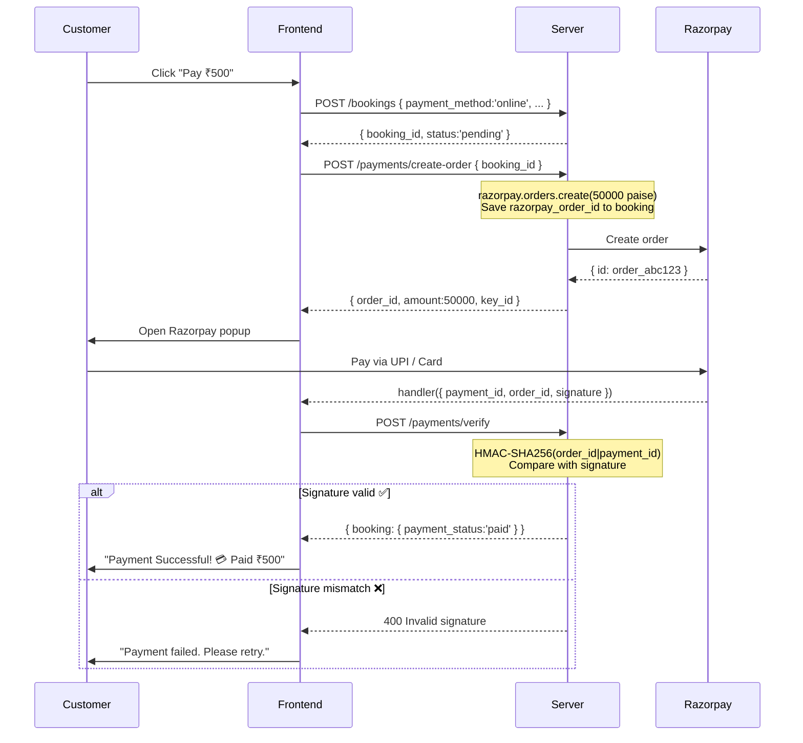
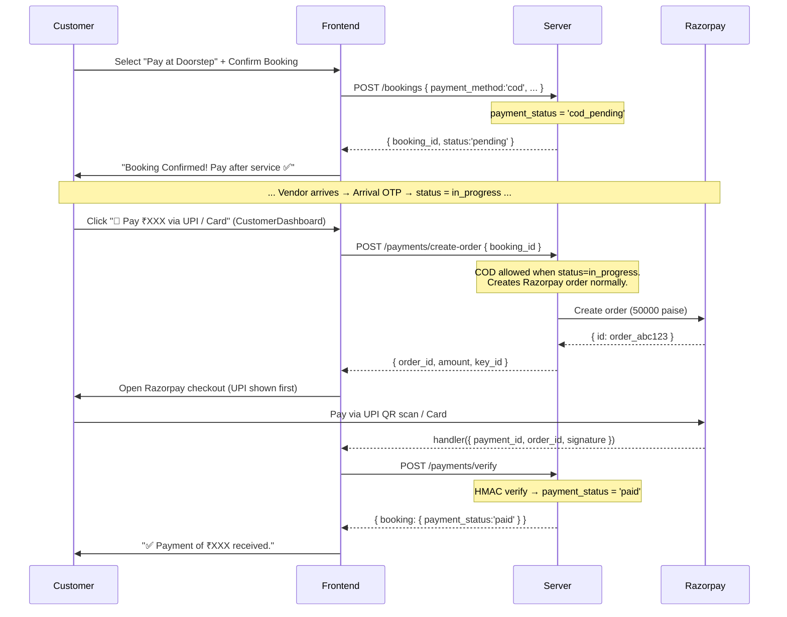

# Veranda — Payments High-Level Design (HLD)

---

## 1. Overview

Veranda supports two payment modes for **service bookings**. Tiffin/food orders always require online payment upfront.

| Property | Value |
|---------|-------|
| Provider | Razorpay |
| Online modes | UPI, Card, Netbanking, Wallets, EMI, Pay Later |
| COD mode | Cash / UPI QR scan at doorstep |
| Currency | INR (₹) |
| Environment | Test (dev) → Live (production) |
| Razorpay fee | ~2% per transaction (online only) |
| Platform commission | 5–10% of booking amount |

---

## 2. Payment Mode Selector (Services Only)

```
┌─────────────────────────────┐  ┌──────────────────────────────┐
│  💳 Pay Online              │  │  💵 Pay at Doorstep          │
│  UPI · Card · Netbanking    │  │  Cash / UPI QR after service │
│                             │  │                              │
│  ✓ Selected (default)       │  │                              │
└─────────────────────────────┘  └──────────────────────────────┘
```

- **Tiffin bookings**: `payment_method` is always `online` (no selector shown — food requires prepayment)
- **Service bookings**: customer chooses before confirming

---

## 3. IO Diagram — Full Payment System

```mermaid
flowchart TD
    subgraph INPUT["📥 Customer Inputs"]
        I1[listing_id]
        I2[scheduled_at]
        I3["address / notes"]
        I4{payment_method}
    end

    subgraph ONLINE["💳 ONLINE FLOW"]
        O1["POST /bookings\npayment_method='online'"]
        O2["Output: booking_id\nstatus=pending\npayment_status=pending"]
        O3["POST /payments/create-order\nInput: booking_id"]
        O4["Output: order_id\namount_paise, key_id"]
        O5["Razorpay Popup\nCustomer pays UPI/Card"]
        O6["Razorpay Callback\nInput: order_id, payment_id, signature"]
        O7["POST /payments/verify\nHMAC-SHA256 check"]
        O8["Output: payment_status=paid\nbooking confirmed ✅"]
    end

    subgraph COD["💵 COD FLOW"]
        C1["POST /bookings\npayment_method='cod'"]
        C2["Output: booking_id\nstatus=pending\npayment_status=cod_pending"]
        C3["Vendor arrives\nArrival OTP → in_progress"]
        C4["POST /payments/create-order\n(allowed now — status=in_progress)"]
        C5["Razorpay Checkout opens\nUPI shown first"]
        C6["Customer pays via UPI/Card\nPlatform receives payment"]
        C7["POST /payments/verify\npayment_status=paid ✅"]
    end

    I1 & I2 & I3 --> I4
    I4 -->|online| ONLINE
    I4 -->|cod| COD

    O1 --> O2 --> O3 --> O4 --> O5 --> O6 --> O7 --> O8
    C1 --> C2 --> C3 --> C4 --> C5 --> C6 --> C7
```



---

## 4. IO Diagram — Razorpay Online Payment Detail



---

## 5. IO Diagram — COD + Pay at Doorstep via Razorpay



> **Key point**: The QR code shown in the Razorpay checkout is **Razorpay's platform QR** — money flows to the platform's account, not directly to the vendor's personal UPI. This is exactly how Urban Company works.

---

## 6. Security: Signature Verification (Online)

Razorpay sends 3 values to frontend after payment:
- `razorpay_order_id`
- `razorpay_payment_id`
- `razorpay_signature`

The signature is **HMAC-SHA256** of `order_id|payment_id` signed with the **Key Secret**. Server verifies before marking paid. **Frontend never sees the Key Secret.**

```javascript
const hmac = createHmac('sha256', RAZORPAY_KEY_SECRET);
hmac.update(`${order_id}|${payment_id}`);
const expected = hmac.digest('hex');
if (expected !== razorpay_signature) → reject with 400
```

---

## 7. API Endpoints

| Method | Endpoint | Auth | Input | Output |
|--------|----------|------|-------|--------|
| `POST` | `/api/bookings` | Customer | `{ listing_id, scheduled_at, address, payment_method }` | `{ booking_id, status, payment_status }` |
| `POST` | `/api/payments/create-order` | Customer | `{ booking_id }` | `{ order_id, amount_paise, key_id }` |
| `POST` | `/api/payments/verify` | Customer | `{ booking_id, order_id, payment_id, signature }` | `{ booking }` |

**Guards on `/payments/create-order`**:
- Returns `400` if `payment_status === 'paid'` (duplicate payment blocked)
- Returns `400` if `payment_method === 'cod'` AND `status !== 'in_progress'` (COD can only pay once service has started)

---

## 8. Database Fields

| Field | Table | Type | Description |
|-------|-------|------|-------------|
| `payment_method` | bookings | `varchar(10)` | `online` (pay at booking) or `cod` (pay at doorstep via Razorpay) |
| `payment_status` | bookings | enum | `pending` → `paid` (online) / `cod_pending` → `paid` (COD) |
| `payment_id` | bookings | text | Razorpay payment ID (set by verify endpoint for both modes) |
| `razorpay_order_id` | bookings | text | Saved when Razorpay order is created |

---

## 9. UPI QR — How Razorpay Shows It

When the Razorpay checkout opens, UPI appears as the **first and default payment block** thanks to the `config.display` setting:

```javascript
config: {
  display: {
    blocks: {
      upi: { name: 'Pay via UPI', instruments: [{ method: 'upi' }] },
    },
    sequence: ['block.upi'],           // UPI shown first
    preferences: { show_default_blocks: true },  // Card/Netbanking still visible below
  },
}
```

**What the customer sees:**
```
┌─────────────────────────────────────────┐
│  Veranda                         ₹500  │
│─────────────────────────────────────────│
│  📱 Pay via UPI                         │
│  ┌───────────────────────────────────┐  │
│  │  [QR CODE — scan with GPay etc.]  │  │  ← Razorpay's platform QR
│  │                                   │  │     NOT vendor's personal UPI
│  │  Or enter UPI ID: ___________     │  │
│  └───────────────────────────────────┘  │
│                                         │
│  💳 Card / Netbanking (below)           │
└─────────────────────────────────────────┘
```

**Money flow**: Customer → Razorpay → Platform account → Vendor payout (future: Razorpay Route)

---

## 10. BookingModal — Payment UX Flow

```
Step 1: Date & Time picker
        ↓
Step 2: Address + Notes
        [Services only — payment selector]
        ┌────────────────┐  ┌─────────────────────┐
        │ 💳 Pay Online  │  │ 💵 Pay at Doorstep  │
        └────────────────┘  └─────────────────────┘
        ↓ Confirm
        [COD]    → booking created instantly
        [Online] → booking → Razorpay order → popup → verify
        ↓
Step 3: Success screen
        [COD]    "Booking Confirmed! 💵 Pay at Doorstep — ₹XXX"
        [Online] "Payment Successful!  💳 Paid ₹XXX"
```

---

## 11. Edge Cases

| Scenario | Handling |
|---------|---------|
| COD booking pays before service starts | `status !== 'in_progress'` guard → 400 |
| COD booking hits Razorpay during service | Allowed — creates order normally |
| Payment cancelled by customer | Error shown: "Booking saved, retry from dashboard" |
| Payment fails (card declined) | `payment.failed` event → user-friendly error |
| Razorpay script fails to load | Fallback error message shown |
| Signature mismatch (tampered) | 400 rejected, console warning logged |
| Duplicate payment attempt | `payment_status === 'paid'` check → 400 |
| Vendor has no UPI ID set | QR modal shows "Pay in cash at doorstep" fallback |

---

## 12. Environment Variables

```env
# server/.env
RAZORPAY_KEY_ID=rzp_test_XXXXXXXXXXXX       # Test: rzp_test_, Live: rzp_live_
RAZORPAY_KEY_SECRET=XXXXXXXXXXXXXXXXXXXXXXXX
```

**Never expose `RAZORPAY_KEY_SECRET` to frontend.** Only `RAZORPAY_KEY_ID` is sent to the client via `/create-order` response.

---

## 13. Revenue Model

```
Online Payment: Customer pays ₹500
  └─ Razorpay fee:  ~₹10  (2%)
  └─ Platform cut:  ~₹50  (10%) → Veranda revenue
  └─ Vendor payout: ₹440  (88%)

COD / UPI QR Payment: Customer pays vendor ₹500 directly
  └─ Platform invoices vendor ₹50 (10%) — future feature
  └─ Vendor keeps: ₹450
```

---

## 14. Getting Razorpay Keys (Free)

1. Sign up at [razorpay.com](https://razorpay.com) — free account
2. Dashboard → Settings → API Keys → **Generate Test Key**
3. Copy `Key ID` + `Key Secret`
4. Paste into `server/.env`
5. For production: switch to Live Mode keys + complete KYC

---

## 15. Future / Pending

| Feature | Description |
|---------|-------------|
| COD "Mark Payment Received" | Vendor button to confirm they received cash/UPI |
| Razorpay Route | Auto-split payment to vendor at payout time |
| Refunds | `razorpay.payments.refund(payment_id)` for cancellations |
| Razorpay Webhook | Server-side confirmation (more reliable than client callback) |
| Subscription | Monthly tiffin plans via Razorpay Subscriptions |
| Invoice PDF | Generate receipt email after payment |
